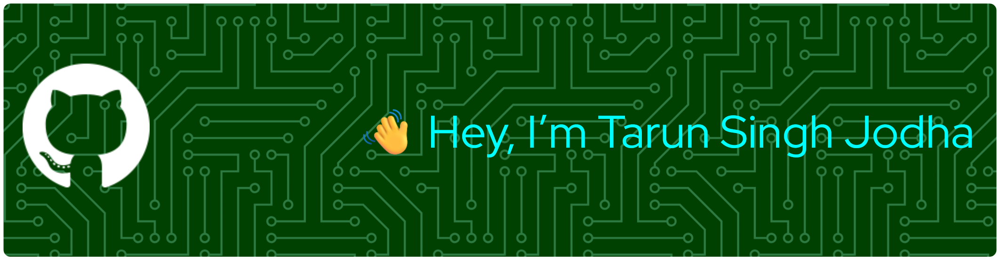

<!-- 🔥 Top Banner -->

  

<h3 align="center">Frontend Developer · Automation & AI Explorer</h3>

  I love building smart, interactive experiences using Web, Automation, and AI. 
  Always learning, always shipping. 🚀

---

## 📊 GitHub Stats & Activity

  

  

  

### 📈 3D Contribution Graph

  

---

## 🛠️ Languages and Tools:

  <!-- Top horizontal bar of T (10 icons wide) -->
  
  
  
  
  
  
  
  
  
  

  <!-- Vertical stem of T (3 icons centered) -->
  
  
  

  
  
  

  
  
  

  
  
  

  
  
  

  
  
  

  
  
  

  
  
  

  
  
  

  
  
  

  
  

---

## 🐍 Contribution Snake

  

---

## 💻 Tech Stack (Text Version)

### ⭐ Core Frontend
- HTML5, CSS3, JavaScript (ES6+)
- TypeScript
- React (learning / using in projects)
- Responsive UI, basic animations

### 🤖 Programming, Data & AI
- Python (scripts, small automation & AI experiments)
- NumPy, Pandas (basic data handling)
- OpenCV (beginner level – experiments)

### 🛠️ Tools & Workflow
- Git, GitHub, GitLab
- Linux (currently using & learning), Bash
- VS Code
- Postman (API testing)
- Notion (planning), Canva & Figma (design drafts)

### 🗄️ Databases & Hosting
- MySQL, MongoDB
- Netlify, Vercel (deploying frontend apps)

### ⚡ Hardware / Electronics
- Arduino
- Raspberry Pi basics
- Electronics & automation interest (ECE background)

---

## 🚀 Highlight Projects

> I'm gradually putting all projects on GitHub. Once repos exist, you can pin them and link them here.

- 🔹 **Jarvis AI Voice Assistant** – Personal voice assistant for automation and tasks (in progress)  
- 🔹 **Screen Capture App** – Electron + TypeScript desktop screen capture tool  
- 🔹 **Temperature Prediction & Automation System** – Predicts temperature & simulates fan control using threshold logic  
- 🔹 **Sports Matches UI** – Frontend that displays upcoming matches using a public sports API  

---

## 🎯 Long-Term Goal

To grow into a strong **Frontend + Automation + AI Developer**  
who builds products that are:

> ⚡ Fast · 🎨 Beautiful · 🤖 Smart · 🧩 Scalable

---

## 🌐 Connect With Me

  

    

      
      
      
    

  

  

 